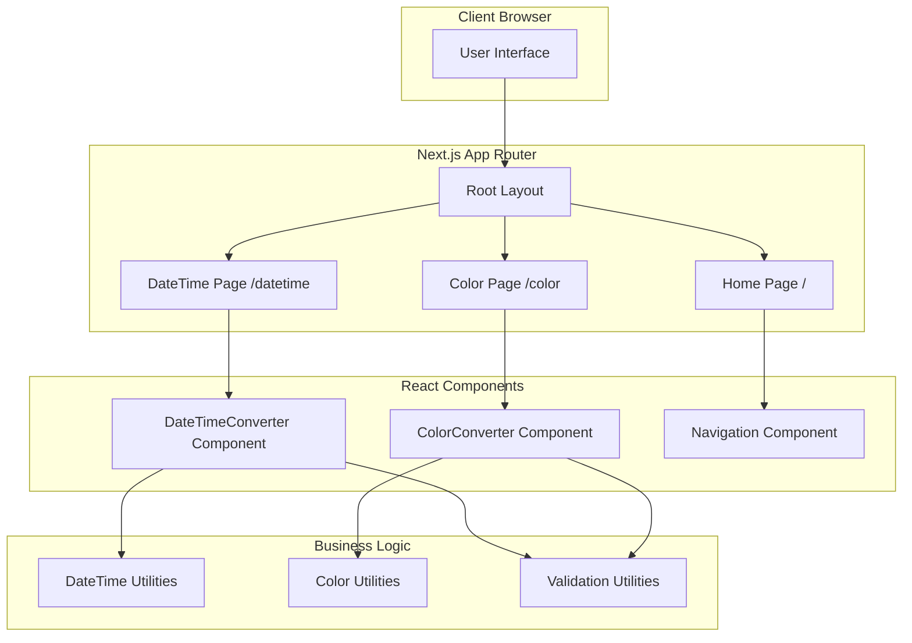
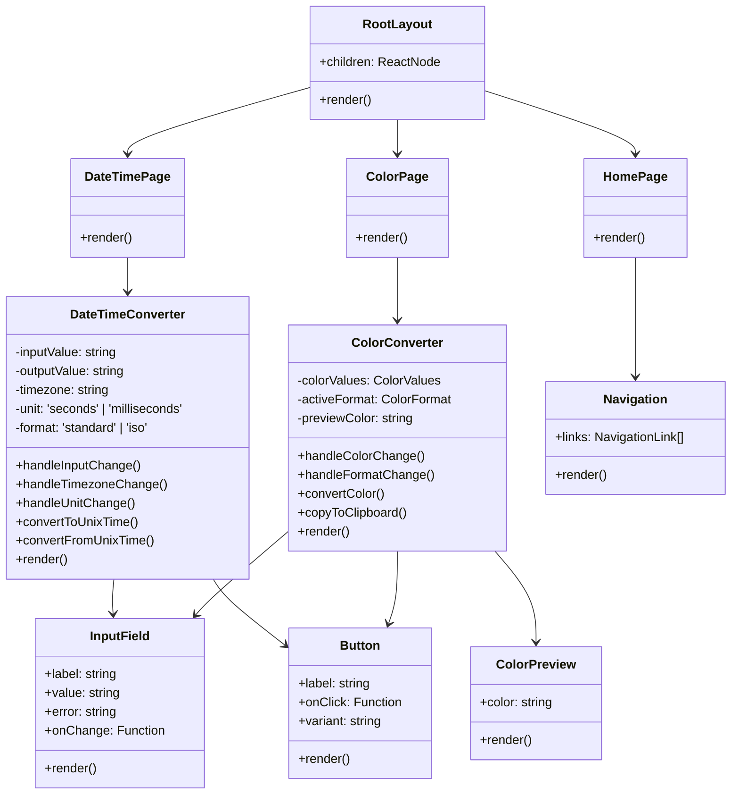
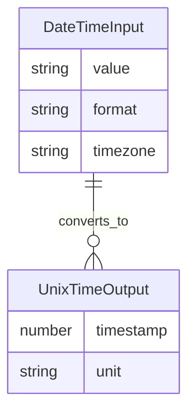
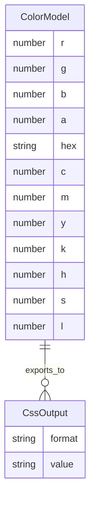
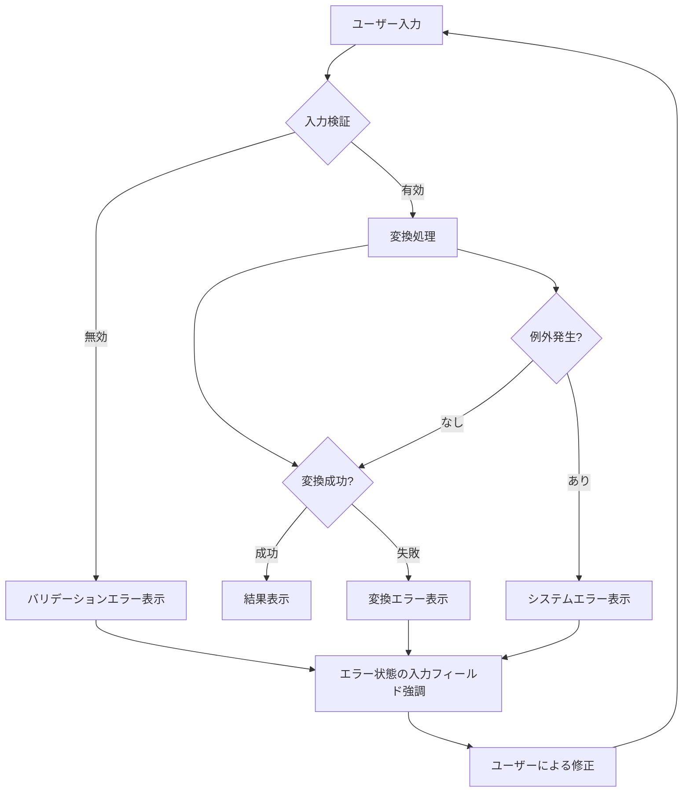

# Data Converter Site 設計ドキュメント

## Overview

Data Converter Siteは、開発者やデザイナーが日常的に必要とするデータ変換機能を提供するWebアプリケーションです。日時形式の変換とカラーコード変換の2つの主要機能を持ち、それぞれが独立したページとして実装されます。

### 主要機能

1. **日時変換機能**
   - 人間が読める日時形式とUnix Time(エポックタイム)の相互変換
   - 複数の日時形式のサポート(YYYY/mm/DD HH:MM:SS、ISO 8601)
   - タイムゾーン対応
   - 秒・ミリ秒単位の切り替え

2. **カラーコード変換機能**
   - 複数のカラーフォーマット間の相互変換(RGB、ARGB、CMYK、HSL)
   - HEX形式と数値形式の両方をサポート
   - リアルタイムカラープレビュー
   - CSS形式でのコピー機能

### 設計原則

- **機能の独立性**: 各機能は独立したURLパスを持ち、個別に開発・テスト可能
- **拡張性**: 新機能の追加が容易な構造
- **レスポンシブデザイン**: すべてのデバイスで快適に使用可能
- **アクセシビリティ**: WCAG 2.1準拠を目指した設計
- **パフォーマンス**: クライアントサイドでの高速な変換処理
- **国際化**: 多言語対応を前提とした設計、将来的な言語追加が容易

## Architecture

### 技術スタック

- **フロントエンドフレームワーク**: Next.js 16.1.6 (App Router)
- **UIライブラリ**: React 19.2.3
- **型システム**: TypeScript 5.x
- **スタイリング**: Tailwind CSS 4.x
- **国際化**: next-intl (Next.js App Router対応)
- **ビルドツール**: Next.js内蔵のWebpack
- **リンター**: ESLint 9.x

### アーキテクチャパターン

本アプリケーションは、Next.js App Routerを活用したモダンなReactアーキテクチャを採用します。



### レイヤー構造

1. **プレゼンテーション層** (src/app/)
   - Next.js App Routerによるルーティング
   - ページコンポーネント
   - レイアウトコンポーネント

2. **コンポーネント層** (src/components/)
   - 再利用可能なUIコンポーネント
   - 機能固有のコンポーネント

3. **ビジネスロジック層** (src/lib/)
   - 変換ロジック
   - バリデーション
   - ユーティリティ関数

4. **型定義層** (src/types/)
   - TypeScript型定義
   - インターフェース定義

## Components and Interfaces

### コンポーネント構成



### 主要インターフェース

#### DateTimeConverter関連

```typescript
interface DateTimeState {
  inputValue: string;
  outputValue: string;
  timezone: string;
  unit: "seconds" | "milliseconds";
  format: "standard" | "iso";
  error: string | null;
}

interface DateTimeConversionResult {
  success: boolean;
  value?: string | number;
  error?: string;
}
```

#### ColorConverter関連

```typescript
interface ColorValues {
  rgb: { r: number; g: number; b: number };
  argb: { a: number; r: number; g: number; b: number };
  hex: string;
  cmyk: { c: number; m: number; y: number; k: number };
  hsl: { h: number; s: number; l: number };
}

interface ColorConversionResult {
  success: boolean;
  values?: Partial<ColorValues>;
  error?: string;
}

type ColorFormat = "rgb" | "argb" | "hex" | "cmyk" | "hsl";
```

### ユーティリティ関数インターフェース

```typescript
// DateTime Utilities
interface DateTimeUtils {
  parseDateTime(input: string, format: "standard" | "iso"): Date | null;
  toUnixTime(date: Date, unit: "seconds" | "milliseconds"): number;
  fromUnixTime(timestamp: number, unit: "seconds" | "milliseconds"): Date;
  formatDateTime(
    date: Date,
    format: "standard" | "iso",
    timezone: string,
  ): string;
  validateDateTime(input: string): boolean;
}

// Color Utilities
interface ColorUtils {
  rgbToHex(r: number, g: number, b: number): string;
  hexToRgb(hex: string): { r: number; g: number; b: number } | null;
  rgbToCmyk(
    r: number,
    g: number,
    b: number,
  ): { c: number; m: number; y: number; k: number };
  cmykToRgb(
    c: number,
    m: number,
    y: number,
    k: number,
  ): { r: number; g: number; b: number };
  rgbToHsl(
    r: number,
    g: number,
    b: number,
  ): { h: number; s: number; l: number };
  hslToRgb(
    h: number,
    s: number,
    l: number,
  ): { r: number; g: number; b: number };
  validateColorValue(value: number, format: ColorFormat): boolean;
  formatCss(color: ColorValues, format: ColorFormat): string;
}
```

## Data Models

### 日時変換データモデル



**DateTimeInput**

- `value`: ユーザーが入力した日時文字列
- `format`: 'standard' (YYYY/mm/DD HH:MM:SS) または 'iso' (ISO 8601)
- `timezone`: タイムゾーン識別子 (例: 'Asia/Tokyo', 'UTC')

**UnixTimeOutput**

- `timestamp`: Unix Time値
- `unit`: 'seconds' または 'milliseconds'

### カラーコード変換データモデル



**ColorModel**

- RGB値: `r`, `g`, `b` (0-255)
- Alpha値: `a` (0-255 または 0-1)
- HEX値: `hex` (例: "#FF0000")
- CMYK値: `c`, `m`, `y`, `k` (0-100%)
- HSL値: `h` (0-360), `s` (0-100%), `l` (0-100%)

**CssOutput**

- `format`: CSS形式の種類 ('rgb', 'rgba', 'hex', 'hsl')
- `value`: CSS文字列 (例: "rgb(255, 0, 0)")

### 状態管理

本アプリケーションは、各ページで独立した状態を管理します。グローバルな状態管理ライブラリは使用せず、React Hooksを活用します。

```typescript
// DateTimeConverterの状態管理例
const useDateTimeConverter = () => {
  const [state, setState] = useState<DateTimeState>({
    inputValue: "",
    outputValue: "",
    timezone: "UTC",
    unit: "seconds",
    format: "standard",
    error: null,
  });

  const convert = useCallback(
    (direction: "toUnix" | "fromUnix") => {
      // 変換ロジック
    },
    [state],
  );

  return { state, setState, convert };
};
```

### 国際化アーキテクチャ

本アプリケーションは、next-intlを使用した国際化対応を実装します。

#### ロケール構成

```typescript
// サポートされるロケール
const locales = ["en", "ja"] as const;
type Locale = (typeof locales)[number];

// デフォルトロケール
const defaultLocale: Locale = "en";
```

#### ディレクトリ構造

```
src/
├── app/
│   └── [locale]/          # ロケールベースのルーティング
│       ├── layout.tsx
│       ├── page.tsx
│       ├── datetime/
│       │   └── page.tsx
│       └── color/
│           └── page.tsx
├── i18n/
│   ├── request.ts         # サーバーサイドi18n設定
│   └── routing.ts         # ルーティング設定
└── messages/              # 翻訳ファイル
    ├── en.json
    └── ja.json
```

#### 翻訳ファイル構造

```json
{
  "common": {
    "siteName": "Data Converter Site",
    "home": "Home",
    "datetime": "DateTime",
    "color": "Color"
  },
  "datetime": {
    "title": "DateTime Converter",
    "toUnixTime": "DateTime to Unix Time",
    "fromUnixTime": "Unix Time to DateTime"
  },
  "color": {
    "title": "Color Code Converter",
    "preview": "Color Preview"
  },
  "errors": {
    "invalidDateTime": "Invalid datetime format",
    "invalidColor": "Invalid color value"
  }
}
```

#### 言語切り替えコンポーネント

```typescript
interface LanguageSwitcherProps {
  currentLocale: Locale;
}

const LanguageSwitcher: React.FC<LanguageSwitcherProps> = ({
  currentLocale,
}) => {
  const router = useRouter();
  const pathname = usePathname();

  const switchLanguage = (locale: Locale) => {
    // ロケールを保持しながらパスを変更
    const newPath = pathname.replace(`/${currentLocale}`, `/${locale}`);
    router.push(newPath);
  };

  return (
    <select value={currentLocale} onChange={(e) => switchLanguage(e.target.value)}>
      <option value="en">English</option>
      <option value="ja">日本語</option>
    </select>
  );
};
```

## Correctness Properties

_プロパティとは、システムのすべての有効な実行において真であるべき特性や動作のことです。本質的には、システムが何をすべきかについての形式的な記述です。プロパティは、人間が読める仕様と機械で検証可能な正確性保証との橋渡しとなります。_

### Property 1: 日時からUnix Timeへの変換の正確性

*任意の*有効な日時文字列(YYYY/mm/DD HH:MM:SS形式またはISO形式)とタイムゾーンに対して、DateTime_Converterが生成するUnix Time値は、指定されたタイムゾーンにおけるその日時の正確なエポックタイムを表す

**Validates: Requirements 1.1, 1.2, 1.3**

### Property 2: Unix Timeから日時への変換の正確性

*任意の*有効なUnix Time値(秒またはミリ秒)とタイムゾーンに対して、DateTime_Converterが生成する日時文字列は、指定されたタイムゾーンにおけるそのUnix Timeの正確な日時を表す

**Validates: Requirements 2.1, 2.2, 2.3, 2.4**

### Property 3: 日時変換のラウンドトリップ

*任意の*有効な日時に対して、日時をUnix Timeに変換してから再び日時に変換すると、元の日時と等価な値が得られる(同じタイムゾーンと形式を使用した場合)

**Validates: Requirements 1.1, 1.2, 2.1, 2.2**

### Property 4: Unix Time単位変換の一貫性

*任意の*日時に対して、秒単位で生成されたUnix Timeの1000倍は、ミリ秒単位で生成されたUnix Timeと等しい

**Validates: Requirements 1.4, 2.2**

### Property 5: RGB-HEX変換のラウンドトリップ

*任意の*有効なRGB値(r, g, b: 0-255)に対して、RGBをHEXに変換してから再びRGBに変換すると、元のRGB値と等しい値が得られる

**Validates: Requirements 3.1, 3.2**

### Property 6: ARGB-HEX変換のラウンドトリップ

*任意の*有効なARGB値(a, r, g, b: 0-255)に対して、ARGBをHEX(#AARRGGBB)に変換してから再びARGBに変換すると、元のARGB値と等しい値が得られる

**Validates: Requirements 3.3, 3.4**

### Property 7: RGB-CMYK変換のラウンドトリップ

*任意の*有効なRGB値に対して、RGBをCMYKに変換してから再びRGBに変換すると、元のRGB値に近似した値が得られる(色空間の違いによる許容誤差内)

**Validates: Requirements 4.1, 4.2**

### Property 8: RGB-HSL変換のラウンドトリップ

*任意の*有効なRGB値に対して、RGBをHSLに変換してから再びRGBに変換すると、元のRGB値と等しい値が得られる

**Validates: Requirements 4.3, 4.4**

### Property 9: CSS形式文字列の正確性

*任意の*有効なカラー値に対して、Color_Converterが生成するCSS形式文字列は、指定された形式(rgb、rgba、hex、hsl)の正しい構文に従い、元のカラー値を正確に表現する

**Validates: Requirements 5.2, 5.3, 5.4, 5.5**

### Property 10: カラープレビューの一貫性

*任意の*有効なカラー値に対して、Color_Converterが表示するプレビュー色は、入力されたカラー値と視覚的に一致する

**Validates: Requirements 3.5**

### Property 11: 無効な入力に対するエラーハンドリング

*任意の*無効な入力(日時形式、Unix Time値、カラーコード)に対して、システムは具体的なエラーメッセージを返し、変換処理を実行しない

**Validates: Requirements 1.5, 2.5, 3.6, 9.1**

### Property 12: エラーメッセージの動的更新

*任意の*エラー状態において、ユーザーが入力を修正したとき、システムは入力の妥当性を再検証し、エラーメッセージをリアルタイムで更新する(有効な入力の場合はエラーを解除し、依然として無効な場合は適切なエラーを表示)

**Validates: Requirements 9.4**

### Property 13: 変換処理のエラーキャッチ

*任意の*変換処理において、予期しないエラーが発生した場合、システムは適切にエラーをキャッチし、ユーザーに理解可能なエラーメッセージを表示する

**Validates: Requirements 9.5**

### Property 14: 言語切り替えの一貫性

*任意の*サポートされているロケール(en, ja)に対して、ユーザーが言語を切り替えたとき、システムはすべてのUIテキスト、エラーメッセージ、日時形式を選択された言語で一貫して表示する

**Validates: Requirements 11.4, 11.7, 11.8**

### Property 15: 言語設定の永続化

*任意の*言語選択に対して、ユーザーがページをリロードまたは再訪問したとき、システムは以前に選択された言語設定を保持し、同じ言語でUIを表示する

**Validates: Requirements 11.5**

## Error Handling

### エラー分類

本アプリケーションでは、以下のエラー分類を採用します:

1. **バリデーションエラー**: ユーザー入力の形式や値が不正な場合
2. **変換エラー**: 変換処理中に発生する論理的なエラー
3. **システムエラー**: 予期しない例外やランタイムエラー

### エラーハンドリング戦略



### エラーメッセージ設計

**バリデーションエラーの例:**

- 日時変換: "無効な日時形式です。YYYY/mm/DD HH:MM:SS形式で入力してください。"
- Unix Time: "無効なUnix Time値です。数値を入力してください。"
- RGB: "RGB値は0-255の範囲で入力してください。"
- HEX: "無効なHEX形式です。#RRGGBBまたは#AARRGGBB形式で入力してください。"

**変換エラーの例:**

- "指定された日時は有効な範囲外です。"
- "カラー変換中にエラーが発生しました。入力値を確認してください。"

**システムエラーの例:**

- "予期しないエラーが発生しました。ページを再読み込みしてください。"

### エラー状態の管理

```typescript
interface ErrorState {
  hasError: boolean;
  errorType: "validation" | "conversion" | "system" | null;
  errorMessage: string | null;
  errorField: string | null; // エラーが発生したフィールドの識別子
}

// エラーハンドリングユーティリティ
const handleError = (error: unknown, context: string): ErrorState => {
  if (error instanceof ValidationError) {
    return {
      hasError: true,
      errorType: "validation",
      errorMessage: error.message,
      errorField: error.field,
    };
  } else if (error instanceof ConversionError) {
    return {
      hasError: true,
      errorType: "conversion",
      errorMessage: error.message,
      errorField: context,
    };
  } else {
    return {
      hasError: true,
      errorType: "system",
      errorMessage: "予期しないエラーが発生しました。",
      errorField: null,
    };
  }
};
```

### アクセシビリティ対応

エラーメッセージは以下のアクセシビリティ要件を満たします:

- `role="alert"` 属性を使用してスクリーンリーダーに通知
- `aria-live="polite"` または `aria-live="assertive"` を適切に使用
- エラーが発生したフィールドに `aria-invalid="true"` を設定
- `aria-describedby` でエラーメッセージとフィールドを関連付け

```tsx
// エラー表示コンポーネントの例
<div role="alert" aria-live="polite">
  {error && <p className="text-red-600">{error.message}</p>}
</div>

<input
  aria-invalid={hasError}
  aria-describedby={hasError ? "error-message" : undefined}
  // ...
/>
```

## Testing Strategy

### テスト戦略の概要

本プロジェクトでは、**二重テストアプローチ**を採用します:

1. **ユニットテスト**: 特定の例、エッジケース、エラー条件を検証
2. **プロパティベーステスト**: すべての入力にわたる普遍的なプロパティを検証

両者は補完的であり、包括的なカバレッジを実現するために両方が必要です。ユニットテストは具体的なバグを捕捉し、プロパティテストは一般的な正確性を検証します。

### プロパティベーステスト

#### 使用ライブラリ

TypeScript/JavaScriptエコシステムでは、**fast-check**をプロパティベーステストライブラリとして使用します。

```bash
npm install --save-dev fast-check
```

#### テスト設定

各プロパティテストは最低100回の反復を実行します(ランダム化のため)。

```typescript
import fc from "fast-check";

// テスト設定
const testConfig = {
  numRuns: 100, // 最低反復回数
  verbose: true,
};
```

#### プロパティテストの実装例

```typescript
// Feature: data-converter-documentation, Property 3: 日時変換のラウンドトリップ
describe("DateTime Converter - Round Trip Property", () => {
  it("should preserve datetime through unix time conversion", () => {
    fc.assert(
      fc.property(
        fc.date({ min: new Date("1970-01-01"), max: new Date("2100-12-31") }),
        fc.constantFrom("UTC", "Asia/Tokyo", "America/New_York"),
        (date, timezone) => {
          // 日時 -> Unix Time -> 日時
          const unixTime = dateTimeUtils.toUnixTime(date, "seconds");
          const convertedDate = dateTimeUtils.fromUnixTime(unixTime, "seconds");
          const formatted1 = dateTimeUtils.formatDateTime(
            date,
            "standard",
            timezone,
          );
          const formatted2 = dateTimeUtils.formatDateTime(
            convertedDate,
            "standard",
            timezone,
          );

          return formatted1 === formatted2;
        },
      ),
      testConfig,
    );
  });
});

// Feature: data-converter-documentation, Property 5: RGB-HEX変換のラウンドトリップ
describe("Color Converter - RGB-HEX Round Trip Property", () => {
  it("should preserve RGB values through HEX conversion", () => {
    fc.assert(
      fc.property(
        fc.integer({ min: 0, max: 255 }),
        fc.integer({ min: 0, max: 255 }),
        fc.integer({ min: 0, max: 255 }),
        (r, g, b) => {
          // RGB -> HEX -> RGB
          const hex = colorUtils.rgbToHex(r, g, b);
          const rgb = colorUtils.hexToRgb(hex);

          return rgb !== null && rgb.r === r && rgb.g === g && rgb.b === b;
        },
      ),
      testConfig,
    );
  });
});

// Feature: data-converter-documentation, Property 11: 無効な入力に対するエラーハンドリング
describe("Error Handling Property", () => {
  it("should return error for any invalid datetime input", () => {
    fc.assert(
      fc.property(
        fc.string().filter((s) => !isValidDateTime(s)),
        (invalidInput) => {
          const result = dateTimeConverter.convert(invalidInput);

          return !result.success && result.error !== undefined;
        },
      ),
      testConfig,
    );
  });
});
```

#### プロパティテストのタグ付け

各プロパティテストには、設計ドキュメントのプロパティを参照するコメントを付けます:

```typescript
// Feature: data-converter-documentation, Property {番号}: {プロパティテキスト}
```

### ユニットテスト

#### ユニットテストのバランス

ユニットテストは特定の例やエッジケースに焦点を当てます。プロパティベーステストが多くの入力をカバーするため、ユニットテストを過度に書く必要はありません。

**ユニットテストの焦点:**

- 具体的な動作を示す例
- コンポーネント間の統合ポイント
- エッジケースとエラー条件

**プロパティテストの焦点:**

- すべての入力に対して成り立つ普遍的なプロパティ
- ランダム化による包括的な入力カバレッジ

#### ユニットテストの実装例

```typescript
describe("DateTimeConverter", () => {
  // 具体的な例
  it("should convert 2024-01-01 00:00:00 UTC to unix time 1704067200", () => {
    const result = dateTimeUtils.toUnixTime(
      new Date("2024-01-01T00:00:00Z"),
      "seconds",
    );
    expect(result).toBe(1704067200);
  });

  // エッジケース
  it("should handle epoch time (1970-01-01 00:00:00 UTC)", () => {
    const result = dateTimeUtils.toUnixTime(
      new Date("1970-01-01T00:00:00Z"),
      "seconds",
    );
    expect(result).toBe(0);
  });

  // エラー条件
  it("should throw error for invalid date string", () => {
    expect(() => dateTimeUtils.parseDateTime("invalid", "standard")).toThrow();
  });
});

describe("ColorConverter", () => {
  // 具体的な例
  it("should convert red RGB(255, 0, 0) to #FF0000", () => {
    const result = colorUtils.rgbToHex(255, 0, 0);
    expect(result).toBe("#FF0000");
  });

  // エッジケース
  it("should handle black RGB(0, 0, 0)", () => {
    const result = colorUtils.rgbToHex(0, 0, 0);
    expect(result).toBe("#000000");
  });

  it("should handle white RGB(255, 255, 255)", () => {
    const result = colorUtils.rgbToHex(255, 255, 255);
    expect(result).toBe("#FFFFFF");
  });
});
```

### E2Eテスト

Playwrightを使用して、ユーザーフローの統合テストを実行します:

```typescript
import { test, expect } from "@playwright/test";

test("datetime conversion user flow", async ({ page }) => {
  await page.goto("/datetime");

  // 日時を入力
  await page.fill('input[name="datetime"]', "2024/01/01 00:00:00");

  // 変換ボタンをクリック
  await page.click('button[type="submit"]');

  // 結果を確認
  const result = await page.textContent('[data-testid="unix-time-result"]');
  expect(result).toContain("1704067200");
});

test("color conversion and copy to clipboard", async ({ page }) => {
  await page.goto("/color");

  // RGB値を入力
  await page.fill('input[name="r"]', "255");
  await page.fill('input[name="g"]', "0");
  await page.fill('input[name="b"]', "0");

  // プレビューを確認
  const preview = await page.locator('[data-testid="color-preview"]');
  await expect(preview).toHaveCSS("background-color", "rgb(255, 0, 0)");

  // CSSコピーボタンをクリック
  await page.click('button[data-testid="copy-css"]');

  // 成功メッセージを確認
  await expect(page.locator('[role="alert"]')).toContainText("コピーしました");
});
```

### テストカバレッジ目標

- **ユニットテスト**: 80%以上のコードカバレッジ
- **プロパティテスト**: すべての設計ドキュメントのプロパティを実装
- **E2Eテスト**: 主要なユーザーフローをカバー

### 継続的インテグレーション

すべてのテストはCI/CDパイプラインで自動実行されます:

```yaml
# .github/workflows/test.yml
name: Test
on: [push, pull_request]
jobs:
  test:
    runs-on: ubuntu-latest
    steps:
      - uses: actions/checkout@v3
      - uses: actions/setup-node@v3
      - run: npm ci
      - run: npm run test # ユニット・プロパティテスト
      - run: npm run test:e2e # E2Eテスト
```
