# Jest から Vitest への移行 - 設計ドキュメント

## 概要

本ドキュメントは、Data Converter SiteのテストフレームワークをJestからVitestへ移行するための技術設計を定義します。

### 移行の目的

- テスト実行速度の向上（Viteの高速なトランスフォーム機能を活用）
- 設定の簡素化（ts-jestの削除、Vite設定の再利用）
- 開発体験の改善（UIモード、高速なウォッチモード）
- 既存のテストロジックとライブラリの完全な互換性維持

### 移行の範囲

**対象**:

- 単体テスト（Jest）→ Vitest
- テスト設定ファイル
- package.json の依存関係とスクリプト

**対象外**:

- E2Eテスト（Playwright）→ 変更なし
- テストロジックの書き換え → 最小限の変更のみ

### 主要な技術的決定

1. **Vitest 2.1.0以上を使用**: 最新の機能とパフォーマンス改善を活用
2. **jsdom環境**: React コンポーネントテストに必要
3. **globals: true**: Jest互換のグローバルAPI（describe, it, expect）を使用
4. **@testing-library/jest-dom/vitest**: Vitest対応のカスタムマッチャー
5. **fast-check**: プロパティベーステストライブラリは変更なし

## アーキテクチャ

### システム構成図

```mermaid
graph TB
    subgraph "開発者環境"
        DEV[開発者]
        CLI[npm コマンド]
    end

    subgraph "テストランナー層"
        VITEST[Vitest]
        PLAYWRIGHT[Playwright]
    end

    subgraph "テスト設定"
        VCONFIG[vitest.config.ts]
        VSETUP[vitest.setup.ts]
        PCONFIG[playwright.config.ts]
    end

    subgraph "テストファイル"
        UNIT[単体テスト<br/>14ファイル]
        E2E[E2Eテスト]
    end

    subgraph "テストライブラリ"
        RTL[@testing-library/react]
        JESTDOM[@testing-library/jest-dom]
        FC[fast-check]
    end

    subgraph "モック"
        MOCK[src/__mocks__/next-intl]
    end

    DEV --> CLI
    CLI -->|npm run test| VITEST
    CLI -->|npm run test:e2e| PLAYWRIGHT

    VITEST --> VCONFIG
    VCONFIG --> VSETUP
    VITEST --> UNIT
    PLAYWRIGHT --> PCONFIG
    PLAYWRIGHT --> E2E

    UNIT --> RTL
    UNIT --> JESTDOM
    UNIT --> FC
    UNIT --> MOCK

    style VITEST fill:#ffd700
    style VCONFIG fill:#ffd700
    style VSETUP fill:#ffd700
    style UNIT fill:#90ee90
    style PLAYWRIGHT fill:#87ceeb
    style E2E fill:#87ceeb
```

### 移行フロー

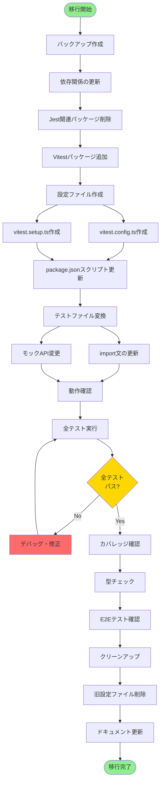

## コンポーネントとインターフェース

### 1. 依存関係管理

#### 削除するパッケージ

| パッケージ名           | 現在のバージョン | 削除理由                         |
| ---------------------- | ---------------- | -------------------------------- |
| jest                   | ^30.2.0          | Vitestに置き換え                 |
| @types/jest            | ^30.0.0          | Vitest型定義を使用               |
| jest-environment-jsdom | ^30.2.0          | jsdomパッケージを直接使用        |
| ts-jest                | ^29.4.6          | Vitestが直接TypeScriptをサポート |

#### 追加するパッケージ

| パッケージ名        | バージョン | 用途                      |
| ------------------- | ---------- | ------------------------- |
| vitest              | ^2.1.0     | テストランナー            |
| @vitest/ui          | ^2.1.0     | UIモード                  |
| @vitest/coverage-v8 | ^2.1.0     | カバレッジレポート生成    |
| jsdom               | ^25.0.0    | DOM環境のシミュレーション |

#### 保持するパッケージ

| パッケージ名                | バージョン | 用途                                     |
| --------------------------- | ---------- | ---------------------------------------- |
| @testing-library/react      | ^16.3.2    | Reactコンポーネントテスト                |
| @testing-library/jest-dom   | ^6.9.1     | カスタムマッチャー（Vitest対応）         |
| @testing-library/user-event | ^14.6.1    | ユーザーインタラクションシミュレーション |
| fast-check                  | ^4.5.3     | プロパティベーステスト                   |

### 2. 設定ファイル

#### vitest.config.ts

```typescript
import { defineConfig } from "vitest/config";
import react from "@vitejs/plugin-react";
import path from "path";

export default defineConfig({
  plugins: [react()],
  test: {
    // グローバルAPI有効化（describe, it, expect）
    globals: true,

    // jsdom環境（React コンポーネントテスト用）
    environment: "jsdom",

    // セットアップファイル
    setupFiles: ["./vitest.setup.ts"],

    // テストファイルパターン
    include: ["src/**/*.{test,spec}.{ts,tsx}"],

    // 除外パターン
    exclude: ["node_modules", "dist", ".next", "**/*.d.ts"],

    // カバレッジ設定
    coverage: {
      provider: "v8",
      reporter: ["text", "json", "html"],
      exclude: [
        "**/*.d.ts",
        "**/*.test.{ts,tsx}",
        "**/*.spec.{ts,tsx}",
        "**/node_modules/**",
        "**/.next/**",
      ],
    },

    // ESMモジュールの処理
    server: {
      deps: {
        inline: ["next-intl", "use-intl"],
      },
    },
  },

  // パスエイリアス
  resolve: {
    alias: {
      "@": path.resolve(__dirname, "./src"),
    },
  },
});
```

**主要な設定項目**:

- `globals: true`: Jest互換のグローバルAPIを有効化
- `environment: "jsdom"`: ブラウザ環境のシミュレーション
- `setupFiles`: テスト実行前の初期化処理
- `server.deps.inline`: next-intlなどのESMモジュールを適切に処理

#### vitest.setup.ts

```typescript
import "@testing-library/jest-dom/vitest";
```

**役割**:

- `@testing-library/jest-dom`のカスタムマッチャーをVitestに登録
- `toBeInTheDocument()`, `toHaveAttribute()` などのマッチャーを使用可能にする

### 3. package.json の変更

#### スクリプトの更新

| スクリプト名    | 変更前（Jest）             | 変更後（Vitest）                       |
| --------------- | -------------------------- | -------------------------------------- |
| test            | `jest`                     | `vitest --run`                         |
| test:watch      | `jest --watch`             | `vitest`                               |
| test:coverage   | `jest --coverage`          | `vitest --coverage`                    |
| test:ui         | -                          | `vitest --ui`                          |
| test:e2e        | `playwright test`          | `playwright test`（変更なし）          |
| test:e2e:ui     | `playwright test --ui`     | `playwright test --ui`（変更なし）     |
| test:e2e:headed | `playwright test --headed` | `playwright test --headed`（変更なし） |

**注意点**:

- `vitest --run`: 1回だけ実行して終了（CI環境向け）
- `vitest`: ウォッチモードで実行（開発環境向け）
- E2Eテストのスクリプトは変更なし

### 4. テストファイルの変換

#### 変換パターン

**パターン1: import文の変更**

```typescript
// 変更前（Jest）
import { describe, it, expect, jest } from "@jest/globals";

// 変更後（Vitest）
import { describe, it, expect, vi } from "vitest";
```

**パターン2: モックAPI の変更**

```typescript
// 変更前（Jest）
const mockFn = jest.fn();
jest.mock("module-name");
jest.spyOn(object, "method");

// 変更後（Vitest）
const mockFn = vi.fn();
vi.mock("module-name");
vi.spyOn(object, "method");
```

**パターン3: @testing-library/jest-dom のインポート削除**

```typescript
// 変更前（Jest）
import "@testing-library/jest-dom"; // ← この行を削除

// 変更後（Vitest）
// vitest.setup.ts で一括インポートするため不要
```

#### 変換対象ファイル一覧

**コンポーネントテスト（7ファイル）**:

1. `src/components/Button.test.tsx`
2. `src/components/ColorConverter.test.tsx`
3. `src/components/ColorConverter.property.test.tsx`
4. `src/components/DateTimeConverter.test.tsx`
5. `src/components/DateTimeConverter.property.test.tsx`
6. `src/components/InputField.test.tsx`
7. `src/components/language-switcher.property.test.tsx`

**ユーティリティテスト（7ファイル）**:

1. `src/lib/color-utils.test.ts`
2. `src/lib/color-utils.property.test.ts`
3. `src/lib/color-utils.performance.test.ts`
4. `src/lib/datetime-utils.test.ts`
5. `src/lib/datetime-utils.property.test.ts`
6. `src/lib/datetime-utils.performance.test.ts`
7. `src/lib/validation-utils.test.ts`

#### 自動変換スクリプト

```bash
# import文の一括置換
find src -name "*.test.ts*" -type f -exec sed -i '' \
  's/@jest\/globals/vitest/g' {} +

# jest.fn() → vi.fn()
find src -name "*.test.ts*" -type f -exec sed -i '' \
  's/jest\.fn()/vi.fn()/g' {} +

# jest.mock() → vi.mock()
find src -name "*.test.ts*" -type f -exec sed -i '' \
  's/jest\.mock(/vi.mock(/g' {} +

# jest.spyOn() → vi.spyOn()
find src -name "*.test.ts*" -type f -exec sed -i '' \
  's/jest\.spyOn(/vi.spyOn(/g' {} +
```

**手動確認が必要な箇所**:

- コメント内の `jest` という文字列
- 変数名として `jest` を使用している場合
- 複雑なモック設定

### 5. next-intl モックの移行

#### 現在のモック実装

`src/__mocks__/next-intl.tsx` は Jest/Vitest 両方で動作する実装になっているため、**変更不要**です。

#### vitest.config.ts での設定

```typescript
export default defineConfig({
  test: {
    // ...
    server: {
      deps: {
        // next-intl を inline 処理して正しくモックを適用
        inline: ["next-intl", "use-intl"],
      },
    },
  },
});
```

**理由**:

- next-intl は ESM モジュールのため、Vitest のデフォルト設定では外部依存として扱われる
- `inline` オプションで Vitest の変換パイプラインに含めることで、モックが正しく適用される

## データモデル

### 移行状態の管理

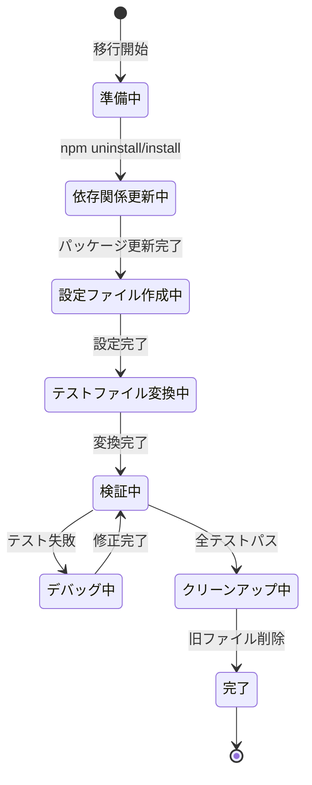

### ファイル構造の変化

```mermaid
graph LR
    subgraph "移行前（Jest）"
        J1[jest.config.js]
        J2[jest.setup.js]
        J3[package.json<br/>Jest依存関係]
        J4[テストファイル<br/>@jest/globals]
    end

    subgraph "移行後（Vitest）"
        V1[vitest.config.ts]
        V2[vitest.setup.ts]
        V3[package.json<br/>Vitest依存関係]
        V4[テストファイル<br/>vitest]
    end

    J1 -.削除.-> V1
    J2 -.削除.-> V2
    J3 -.更新.-> V3
    J4 -.変換.-> V4

    style J1 fill:#ffcccc
    style J2 fill:#ffcccc
    style V1 fill:#ccffcc
    style V2 fill:#ccffcc
```

### テストファイルの変換マッピング

| 変換対象          | 変換方法                   | 影響範囲     |
| ----------------- | -------------------------- | ------------ |
| import文          | `@jest/globals` → `vitest` | 全14ファイル |
| モックAPI         | `jest.*` → `vi.*`          | 一部ファイル |
| jest-dom import   | 削除                       | 一部ファイル |
| テストロジック    | 変更なし                   | 全ファイル   |
| fast-check        | 変更なし                   | 4ファイル    |
| performance.now() | 変更なし                   | 2ファイル    |

## 正確性プロパティ

プロパティとは、システムのすべての有効な実行において真であるべき特性や動作のことです。これは、人間が読める仕様と機械が検証可能な正確性保証の橋渡しとなる形式的な記述です。

### プロパティ反映

prework分析の結果、多くの受入基準が具体的な例（example）として分類されました。これらは移行完了後の状態を検証するためのチェックリストとして機能します。一方、以下の2つの基準はプロパティとして定式化できます：

**統合可能なプロパティ**:

- 5.1と5.2は「テストファイルの変換」という1つの包括的なプロパティに統合可能

### プロパティ1: テストファイルのVitest互換性

*任意の*テストファイルに対して、以下の条件を満たす必要がある：

- `@testing-library/jest-dom` の直接インポートが存在しない
- Jest固有のAPI（`jest.fn()`, `jest.mock()` など）が存在しない
- Vitest互換のAPI（`vi.fn()`, `vi.mock()` など）を使用している
- TypeScript型エラーが発生しない

**検証方法**: Requirements 5.1, 5.2

### 移行完了の検証基準

以下は移行が正しく完了したことを確認するための具体的なチェックリストです：

#### 依存関係の検証

- [ ] package.json に `vitest` が含まれている
- [ ] package.json に `@vitest/ui` が含まれている
- [ ] package.json に `@vitest/coverage-v8` が含まれている
- [ ] package.json に `jsdom` が含まれている
- [ ] package.json から `jest` が削除されている
- [ ] package.json から `@types/jest` が削除されている
- [ ] package.json から `jest-environment-jsdom` が削除されている
- [ ] package.json から `ts-jest` が削除されている
- [ ] package.json に `@testing-library/react` が保持されている
- [ ] package.json に `@testing-library/jest-dom` が保持されている
- [ ] package.json に `fast-check` が保持されている

**検証**: Requirements 1.1-1.11

#### 設定ファイルの検証

- [ ] `vitest.config.ts` がプロジェクトルートに存在する
- [ ] `test.environment` が `"jsdom"` に設定されている
- [ ] `test.include` が `src/**/*.{test,spec}.{ts,tsx}` に設定されている
- [ ] `test.exclude` に `node_modules`, `dist`, `.next` が含まれている
- [ ] `resolve.alias` で `@/*` が `./src/*` にマッピングされている
- [ ] `test.globals` が `true` に設定されている
- [ ] `test.setupFiles` が `./vitest.setup.ts` に設定されている
- [ ] `test.coverage.provider` が `"v8"` に設定されている
- [ ] `test.coverage.reporter` が `["text", "json", "html"]` に設定されている
- [ ] `test.coverage.exclude` に適切なパターンが設定されている
- [ ] `vitest.setup.ts` が存在する
- [ ] `vitest.setup.ts` が `@testing-library/jest-dom/vitest` をインポートしている
- [ ] `jest.setup.js` が削除されている
- [ ] `jest.config.js` が削除されている

**検証**: Requirements 2.1-2.10, 3.1-3.4

#### スクリプトの検証

- [ ] `"test"` スクリプトが `"vitest --run"` になっている
- [ ] `"test:watch"` スクリプトが `"vitest"` になっている
- [ ] `"test:coverage"` スクリプトが `"vitest --coverage"` になっている
- [ ] `"test:ui"` スクリプトが `"vitest --ui"` として追加されている
- [ ] `"test:e2e"` スクリプトが保持されている
- [ ] `"test:e2e:ui"` スクリプトが保持されている
- [ ] `"test:e2e:headed"` スクリプトが保持されている

**検証**: Requirements 4.1-4.7

#### テスト実行の検証

- [ ] `npm run test` を実行すると全テストが実行される
- [ ] 全テストケースが成功する
- [ ] 14個のテストファイルが実行される
- [ ] コンポーネントテスト7ファイルが含まれる
- [ ] ユーティリティテスト7ファイルが含まれる
- [ ] プロパティベーステストが正常に動作する
- [ ] パフォーマンステストが正常に動作する

**検証**: Requirements 7.1-7.7

#### カバレッジの検証

- [ ] `npm run test:coverage` を実行するとカバレッジレポートが生成される
- [ ] テキスト形式のレポートが出力される
- [ ] JSON形式のレポートが生成される
- [ ] HTML形式のレポートが生成される
- [ ] `**/*.d.ts` ファイルが除外されている
- [ ] テストファイルが除外されている
- [ ] `node_modules` ディレクトリが除外されている
- [ ] `.next` ディレクトリが除外されている

**検証**: Requirements 8.1-8.8

#### TypeScript型定義の検証

- [ ] Vitest型定義がグローバルに提供されている
- [ ] TypeScriptコンパイラを実行しても型エラーが発生しない
- [ ] `describe`, `it`, `expect` が型安全に使用できる
- [ ] `vi.mock`, `vi.fn` が型安全に使用できる

**検証**: Requirements 10.1-10.4

#### 特殊なテストの検証

- [ ] パフォーマンステストが実行時間を測定できる
- [ ] タイムアウト設定が機能する
- [ ] 処理時間が閾値を超えた場合にテストが失敗する
- [ ] fast-checkのプロパティテストが実行される
- [ ] プロパティ違反時に反例が報告される
- [ ] fast-checkの設定が保持されている
- [ ] シード値による再現性が保持されている

**検証**: Requirements 11.1-11.3, 12.1-12.4

#### モックの検証

- [ ] `src/__mocks__/next-intl` ディレクトリが保持されている
- [ ] next-intl モジュールのモックパスが設定されている
- [ ] next-intl を使用するテストでモック実装が適用される

**検証**: Requirements 6.1-6.3

#### 後方互換性の検証

- [ ] `playwright.config.ts` が保持されている
- [ ] `e2e` ディレクトリが保持されている
- [ ] E2Eテストが正常に実行される
- [ ] 単体テスト設定とE2Eテスト設定が分離されている

**検証**: Requirements 14.1-14.4

## エラーハンドリング

### 想定されるエラーと対処法

#### 1. 依存関係のインストールエラー

**エラー**: npm install 時にパッケージの競合が発生

```
npm ERR! ERESOLVE unable to resolve dependency tree
```

**原因**:

- 既存のパッケージとの依存関係の競合
- package-lock.json のキャッシュ問題

**対処法**:

```bash
# package-lock.json を削除して再インストール
rm package-lock.json
rm -rf node_modules
npm install
```

#### 2. next-intl モックが適用されない

**エラー**: next-intl を使用するテストが失敗

```
Error: Cannot find module 'next-intl'
```

**原因**:

- ESMモジュールがVitestの変換パイプラインに含まれていない
- モックパスの設定が不適切

**対処法**:

```typescript
// vitest.config.ts
export default defineConfig({
  test: {
    server: {
      deps: {
        inline: ["next-intl", "use-intl"], // ← この設定を追加
      },
    },
  },
});
```

#### 3. TypeScript型エラー

**エラー**: テストファイルで型エラーが発生

```
Property 'toBeInTheDocument' does not exist on type 'Matchers'
```

**原因**:

- `@testing-library/jest-dom` のインポートが不適切
- `vitest.setup.ts` の設定が反映されていない

**対処法**:

```typescript
// vitest.setup.ts で正しくインポート
import "@testing-library/jest-dom/vitest";

// vitest.config.ts で globals を有効化
export default defineConfig({
  test: {
    globals: true, // ← この設定を確認
    setupFiles: ["./vitest.setup.ts"],
  },
});
```

#### 4. パフォーマンステストのタイムアウト

**エラー**: パフォーマンステストがタイムアウトで失敗

```
Test timed out in 5000ms
```

**原因**:

- デフォルトのタイムアウト時間が短い
- パフォーマンステストの実行時間が長い

**対処法**:

```typescript
// 個別のテストでタイムアウトを設定
it("should complete within time limit", { timeout: 10000 }, () => {
  // テストコード
});

// または vitest.config.ts でグローバルに設定
export default defineConfig({
  test: {
    testTimeout: 10000,
  },
});
```

#### 5. fast-check のシード再現性の問題

**エラー**: fast-check のテストが不安定

**原因**:

- シード値が正しく設定されていない
- ランダム性の扱いが異なる

**対処法**:

```typescript
// fast-check の設定でシードを明示的に指定
fc.assert(fc.property(/* ... */), {
  seed: 42, // 固定シード
  numRuns: 100,
});
```

#### 6. カバレッジレポートが生成されない

**エラー**: `npm run test:coverage` を実行してもレポートが生成されない

**原因**:

- `@vitest/coverage-v8` がインストールされていない
- カバレッジ設定が不適切

**対処法**:

```bash
# カバレッジプロバイダーをインストール
npm install -D @vitest/coverage-v8

# vitest.config.ts で設定を確認
export default defineConfig({
  test: {
    coverage: {
      provider: "v8",
      reporter: ["text", "json", "html"]
    }
  }
});
```

### エラー検出フロー

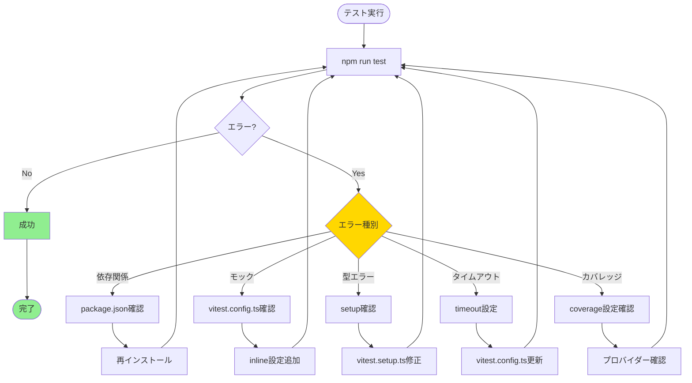

### デバッグのベストプラクティス

1. **段階的な確認**
   - まず1つのテストファイルで動作確認
   - 問題がなければ全テストを実行

2. **詳細なログ出力**

   ```bash
   # 詳細モードで実行
   npm run test -- --reporter=verbose
   ```

3. **個別テストの実行**

   ```bash
   # 特定のファイルのみ実行
   npm run test src/components/Button.test.tsx
   ```

4. **UIモードでのデバッグ**
   ```bash
   # UIモードで視覚的に確認
   npm run test:ui
   ```

## テスト戦略

### デュアルテストアプローチ

移行の検証には、単体テストとプロパティベーステストの両方を使用します。

#### 単体テスト

**目的**: 移行後の具体的な状態を検証

**対象**:

- 設定ファイルの内容確認
- package.json の依存関係確認
- テストファイルの構文確認
- 特定のテストケースの実行結果

**実装方法**:

```typescript
// 例: 設定ファイルの検証
describe("vitest.config.ts", () => {
  it("should have jsdom environment", () => {
    const config = require("./vitest.config");
    expect(config.test.environment).toBe("jsdom");
  });

  it("should have correct setupFiles", () => {
    const config = require("./vitest.config");
    expect(config.test.setupFiles).toContain("./vitest.setup.ts");
  });
});
```

#### プロパティベーステスト

**目的**: すべてのテストファイルに対する普遍的な性質を検証

**プロパティ1の実装**:

```typescript
import fc from "fast-check";
import fs from "fs";
import path from "path";
import { glob } from "glob";

describe("Property 1: テストファイルのVitest互換性", () => {
  it("任意のテストファイルがVitest互換である", () => {
    // すべてのテストファイルを取得
    const testFiles = glob.sync("src/**/*.{test,spec}.{ts,tsx}");

    fc.assert(
      fc.property(fc.constantFrom(...testFiles), (filePath) => {
        const content = fs.readFileSync(filePath, "utf-8");

        // @testing-library/jest-dom の直接インポートがない
        const hasJestDomImport = content.includes(
          'import "@testing-library/jest-dom"',
        );

        // Jest固有のAPIが存在しない
        const hasJestApi = /jest\.(fn|mock|spyOn)\(/.test(content);

        // Vitest互換のAPIを使用している（モックを使う場合）
        const hasViApi = /vi\.(fn|mock|spyOn)\(/.test(content);
        const hasMocking = content.includes("mock") || content.includes("fn()");

        return !hasJestDomImport && !hasJestApi && (!hasMocking || hasViApi);
      }),
      { numRuns: 14 }, // 14ファイル全てをチェック
    );
  });
});
```

**Feature**: jest-to-vitest-migration, Property 1: 任意のテストファイルがVitest互換である

### テスト実行戦略

#### フェーズ1: 移行前のベースライン確認

```bash
# Jest でのテスト実行（移行前）
npm run test

# 結果を記録
# - 実行時間
# - テスト数
# - カバレッジ
```

#### フェーズ2: 移行後の動作確認

```bash
# Vitest でのテスト実行（移行後）
npm run test

# 結果を比較
# - すべてのテストがパスすること
# - テスト数が同じであること
# - カバレッジが同等以上であること
```

#### フェーズ3: パフォーマンス測定

```bash
# 実行時間の測定
time npm run test

# ウォッチモードの反応速度確認
npm run test:watch
# ファイルを変更して再実行時間を測定
```

#### フェーズ4: 統合確認

```bash
# E2Eテストが影響を受けていないことを確認
npm run test:e2e

# すべてのテストコマンドの動作確認
npm run test
npm run test:watch
npm run test:coverage
npm run test:ui
```

### テストカバレッジ目標

| 項目                 | 目標                   |
| -------------------- | ---------------------- |
| 全体カバレッジ       | 移行前と同等以上       |
| テスト成功率         | 100%                   |
| テストファイル数     | 14ファイル（変更なし） |
| プロパティテスト     | 4ファイル（変更なし）  |
| パフォーマンステスト | 2ファイル（変更なし）  |

### 継続的な検証

移行完了後も以下を継続的に確認：

1. **CI/CDでの自動テスト**
   - すべてのプルリクエストでテスト実行
   - カバレッジレポートの生成

2. **定期的なパフォーマンス測定**
   - テスト実行時間の監視
   - 劣化がないことの確認

3. **新規テストの追加時**
   - Vitest APIの使用を確認
   - プロパティ1の検証を実行

## パフォーマンス最適化

### Vitestの高速化機能

#### 1. 並列実行

Vitestはデフォルトでテストを並列実行します。

```typescript
// vitest.config.ts
export default defineConfig({
  test: {
    // 並列実行の設定（デフォルトで有効）
    pool: "threads", // または "forks"
    poolOptions: {
      threads: {
        // 最大スレッド数（デフォルト: CPU コア数）
        maxThreads: 4,
        minThreads: 1,
      },
    },
  },
});
```

**期待される効果**:

- テスト実行時間が30-50%短縮
- 特に多数のテストファイルがある場合に効果的

#### 2. キャッシュ戦略

Vitestは変更されたファイルのみを再テストします。

```typescript
// vitest.config.ts
export default defineConfig({
  test: {
    // キャッシュディレクトリ
    cache: {
      dir: "node_modules/.vitest",
    },
  },
});
```

**キャッシュの動作**:

- 初回実行: すべてのテストを実行
- 2回目以降: 変更されたファイルに関連するテストのみ実行
- ウォッチモード: ファイル変更を検知して即座に再実行

#### 3. トランスフォームの最適化

VitestはViteのトランスフォーム機能を活用します。

```typescript
// vitest.config.ts
export default defineConfig({
  plugins: [react()], // Viteプラグインを使用
  test: {
    // TypeScriptのトランスパイルが高速
    // ts-jest不要
  },
});
```

**利点**:

- TypeScriptのトランスパイルが高速
- ESMネイティブサポート
- HMR（Hot Module Replacement）の活用

### パフォーマンス測定

#### ベンチマーク計画

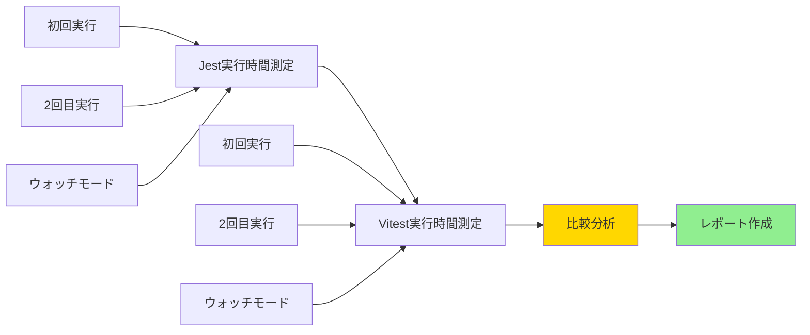

#### 測定項目

| 項目                   | Jest | Vitest | 改善目標 |
| ---------------------- | ---- | ------ | -------- |
| 初回実行時間           | 測定 | 測定   | -30%     |
| 2回目実行時間          | 測定 | 測定   | -50%     |
| ウォッチモード反応時間 | 測定 | 測定   | -60%     |
| カバレッジ生成時間     | 測定 | 測定   | -20%     |

#### 測定スクリプト

```bash
#!/bin/bash

echo "=== Jest Performance ==="
echo "Initial run:"
time npm run test

echo "Second run:"
time npm run test

echo "Coverage:"
time npm run test:coverage

echo ""
echo "=== Vitest Performance ==="
echo "Initial run:"
time npm run test

echo "Second run:"
time npm run test

echo "Coverage:"
time npm run test:coverage
```

### メモリ使用量の最適化

#### 設定による最適化

```typescript
// vitest.config.ts
export default defineConfig({
  test: {
    // メモリ使用量の制限
    poolOptions: {
      threads: {
        maxThreads: 4, // スレッド数を制限
        isolate: false, // テスト間の分離を緩和（高速化）
      },
    },

    // 大きなファイルの処理
    maxConcurrency: 5, // 同時実行数の制限
  },
});
```

**注意点**:

- `isolate: false` はテスト間の分離を緩和するため、副作用に注意
- メモリ制約がある環境では `maxThreads` を調整

### ウォッチモードの最適化

#### ファイル監視の設定

```typescript
// vitest.config.ts
export default defineConfig({
  test: {
    // ウォッチモードの設定
    watch: true,

    // 監視から除外するパターン
    watchExclude: [
      "**/node_modules/**",
      "**/dist/**",
      "**/.next/**",
      "**/coverage/**",
    ],
  },
});
```

**効果**:

- 不要なファイルの監視を避けることで反応速度向上
- CPU使用率の削減

### 期待されるパフォーマンス改善

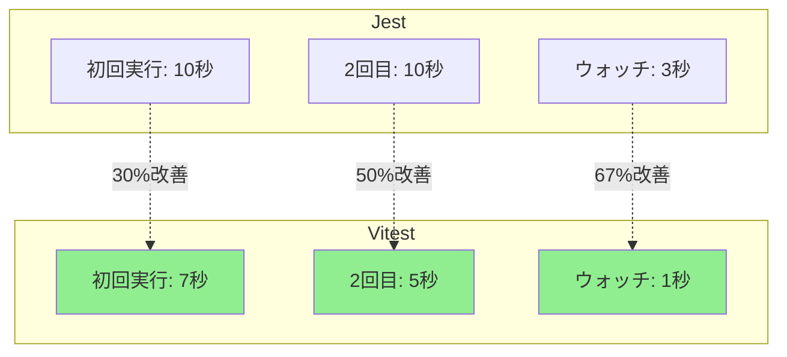

**注**: 実際の数値は環境により異なります。上記は一般的な改善例です。

## 移行手順の詳細フロー

### 全体フロー

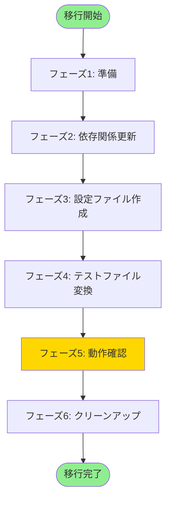

### フェーズ1: 準備（推定時間: 15分）

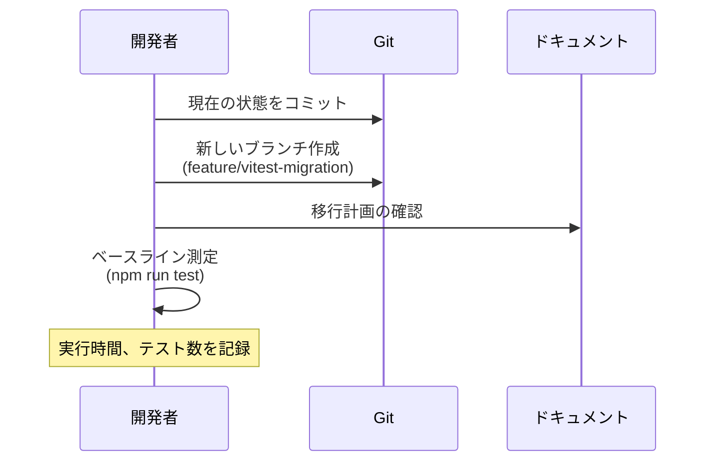

**チェックリスト**:

- [ ] すべての変更がコミットされている
- [ ] 新しいブランチを作成した
- [ ] 現在のテストがすべてパスしている
- [ ] ベースライン測定を完了した

### フェーズ2: 依存関係更新（推定時間: 10分）

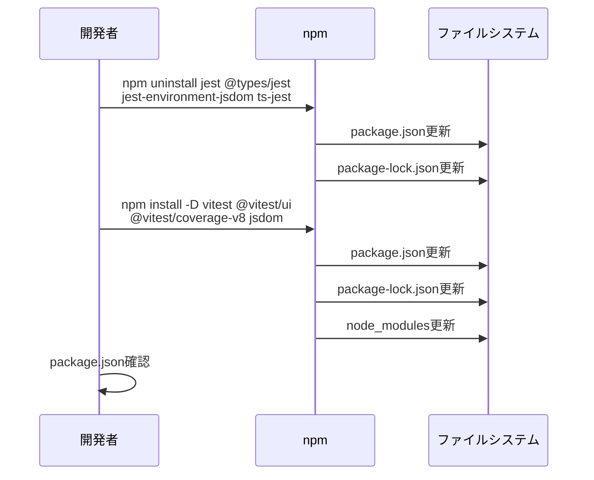

**コマンド**:

```bash
# Jest関連パッケージの削除
npm uninstall jest @types/jest jest-environment-jsdom ts-jest

# Vitest関連パッケージの追加
npm install -D vitest @vitest/ui @vitest/coverage-v8 jsdom
```

**検証**:

```bash
# package.jsonの確認
cat package.json | grep -E "(vitest|jest)"
```

### フェーズ3: 設定ファイル作成（推定時間: 20分）

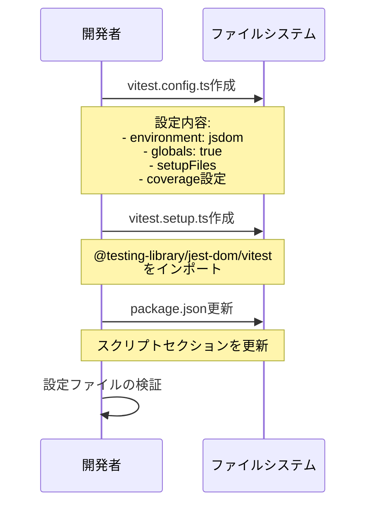

**作成するファイル**:

1. `vitest.config.ts`:

```typescript
import { defineConfig } from "vitest/config";
import react from "@vitejs/plugin-react";
import path from "path";

export default defineConfig({
  plugins: [react()],
  test: {
    globals: true,
    environment: "jsdom",
    setupFiles: ["./vitest.setup.ts"],
    include: ["src/**/*.{test,spec}.{ts,tsx}"],
    exclude: ["node_modules", "dist", ".next", "**/*.d.ts"],
    coverage: {
      provider: "v8",
      reporter: ["text", "json", "html"],
      exclude: [
        "**/*.d.ts",
        "**/*.test.{ts,tsx}",
        "**/*.spec.{ts,tsx}",
        "**/node_modules/**",
        "**/.next/**",
      ],
    },
    server: {
      deps: {
        inline: ["next-intl", "use-intl"],
      },
    },
  },
  resolve: {
    alias: {
      "@": path.resolve(__dirname, "./src"),
    },
  },
});
```

2. `vitest.setup.ts`:

```typescript
import "@testing-library/jest-dom/vitest";
```

3. `package.json` のスクリプト更新:

```json
{
  "scripts": {
    "test": "vitest --run",
    "test:watch": "vitest",
    "test:coverage": "vitest --coverage",
    "test:ui": "vitest --ui",
    "test:e2e": "playwright test",
    "test:e2e:ui": "playwright test --ui",
    "test:e2e:headed": "playwright test --headed"
  }
}
```

### フェーズ4: テストファイル変換（推定時間: 30分）

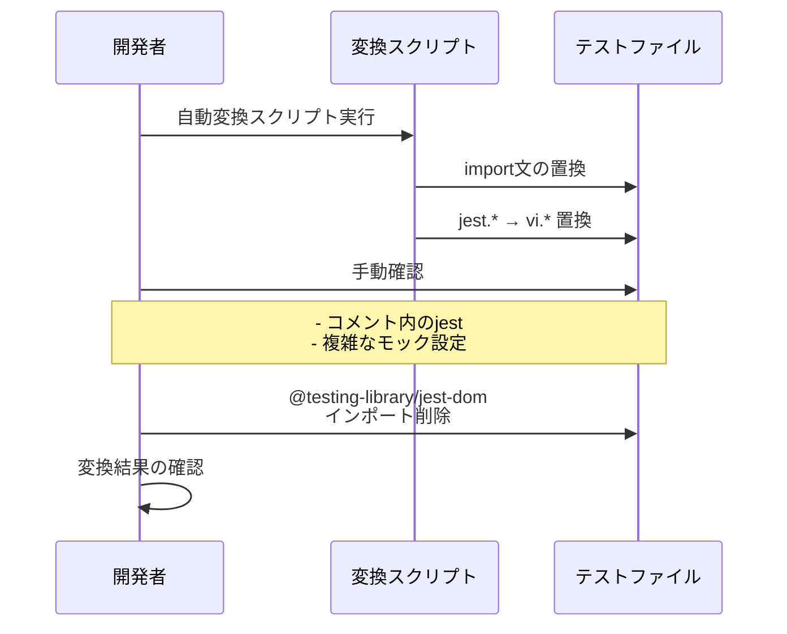

**自動変換スクリプト**:

```bash
#!/bin/bash

echo "テストファイルの自動変換を開始..."

# import文の置換
find src -name "*.test.ts*" -type f -exec sed -i '' \
  's/@jest\/globals/vitest/g' {} +

# jest.fn() → vi.fn()
find src -name "*.test.ts*" -type f -exec sed -i '' \
  's/jest\.fn()/vi.fn()/g' {} +

# jest.mock() → vi.mock()
find src -name "*.test.ts*" -type f -exec sed -i '' \
  's/jest\.mock(/vi.mock(/g' {} +

# jest.spyOn() → vi.spyOn()
find src -name "*.test.ts*" -type f -exec sed -i '' \
  's/jest\.spyOn(/vi.spyOn(/g' {} +

echo "自動変換完了。手動確認を行ってください。"
```

**手動確認項目**:

- [ ] すべてのテストファイルで import文が更新されている
- [ ] jest._ が vi._ に置換されている
- [ ] コメント内の jest は変更されていないことを確認
- [ ] @testing-library/jest-dom のインポートを削除

### フェーズ5: 動作確認（推定時間: 30分）

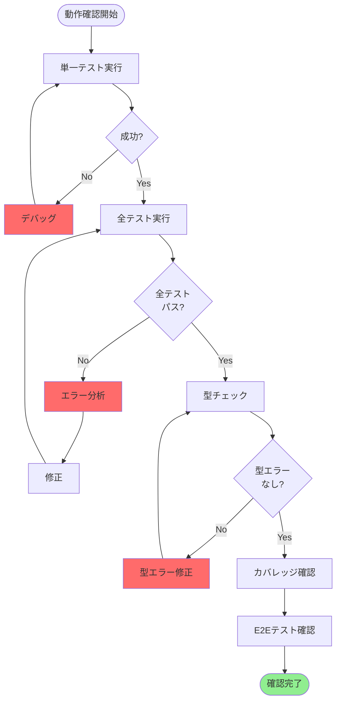

**実行コマンド**:

```bash
# 1. 単一テストファイルで確認
npm run test src/components/Button.test.tsx

# 2. 全テスト実行
npm run test

# 3. 型チェック
npx tsc --noEmit

# 4. カバレッジ確認
npm run test:coverage

# 5. E2Eテスト確認
npm run test:e2e
```

**検証項目**:

- [ ] すべてのテストがパスする
- [ ] 14個のテストファイルが実行される
- [ ] 型エラーが発生しない
- [ ] カバレッジレポートが生成される
- [ ] E2Eテストが正常に動作する

### フェーズ6: クリーンアップ（推定時間: 15分）

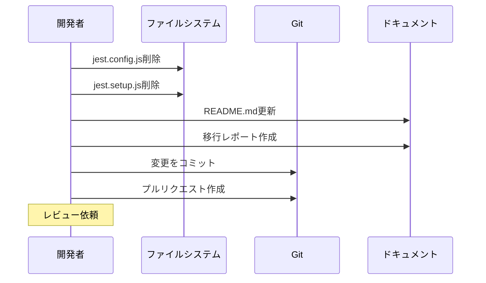

**削除するファイル**:

```bash
rm jest.config.js
rm jest.setup.js
```

**更新するドキュメント**:

- README.md: テストコマンドの説明を更新
- 移行レポート: 移行前後の比較、パフォーマンス測定結果

**最終チェックリスト**:

- [ ] 旧設定ファイルを削除した
- [ ] ドキュメントを更新した
- [ ] すべての変更をコミットした
- [ ] プルリクエストを作成した

## リスク管理

### リスク評価マトリクス

| リスク                             | 影響度 | 発生確率 | 優先度 | 対策                     |
| ---------------------------------- | ------ | -------- | ------ | ------------------------ |
| next-intlモックが動作しない        | 高     | 中       | 高     | inline設定の追加         |
| パフォーマンステストのタイムアウト | 中     | 低       | 中     | timeout設定の調整        |
| 型エラーの発生                     | 中     | 低       | 中     | setup確認、globals有効化 |
| fast-checkの互換性問題             | 低     | 極低     | 低     | 事前動作確認             |
| E2Eテストへの影響                  | 高     | 極低     | 中     | 設定の完全分離           |
| カバレッジ低下                     | 中     | 低       | 中     | 除外設定の確認           |

### リスク対応計画

#### リスク1: next-intlモックが動作しない

**影響**: next-intlを使用するコンポーネントテストが失敗

**検出方法**:

```bash
# next-intlを使用するテストを実行
npm run test src/components/DateTimeConverter.test.tsx
```

**対応手順**:

1. エラーメッセージを確認
2. `vitest.config.ts` の `server.deps.inline` 設定を確認
3. 必要に応じて追加のモジュールを inline に追加
4. モックファイルの実装を確認

**ロールバック条件**:

- 2時間以内に解決できない場合
- 複数のテストで同様の問題が発生する場合

#### リスク2: パフォーマンステストのタイムアウト

**影響**: パフォーマンステストが不安定になる

**検出方法**:

```bash
# パフォーマンステストを実行
npm run test src/lib/color-utils.performance.test.ts
npm run test src/lib/datetime-utils.performance.test.ts
```

**対応手順**:

1. デフォルトのタイムアウト時間を確認
2. テストごとにタイムアウトを設定
3. 必要に応じてグローバル設定を調整

**設定例**:

```typescript
// vitest.config.ts
export default defineConfig({
  test: {
    testTimeout: 10000, // 10秒に延長
  },
});
```

#### リスク3: 型エラーの発生

**影響**: TypeScriptコンパイルが失敗する

**検出方法**:

```bash
# 型チェック実行
npx tsc --noEmit
```

**対応手順**:

1. エラーメッセージから原因を特定
2. `vitest.setup.ts` の設定を確認
3. `globals: true` が有効になっているか確認
4. 必要に応じて型定義ファイルを追加

#### リスク4: E2Eテストへの影響

**影響**: Playwrightテストが動作しなくなる

**検出方法**:

```bash
# E2Eテスト実行
npm run test:e2e
```

**対応手順**:

1. `playwright.config.ts` が変更されていないことを確認
2. E2Eテストディレクトリが保持されていることを確認
3. Vitestの設定がE2Eテストに影響していないことを確認

**予防策**:

- Vitestの設定で `include` パターンを明示的に指定
- E2Eテストディレクトリを除外

### ロールバック計画

#### ロールバック条件

以下のいずれかに該当する場合、ロールバックを検討：

1. **重大な問題**:
   - 2時間以内に解決できない技術的問題
   - 複数のテストで同時に失敗
   - E2Eテストへの予期しない影響

2. **パフォーマンス劣化**:
   - テスト実行時間が移行前より遅い
   - メモリ使用量が大幅に増加

3. **互換性問題**:
   - fast-checkが動作しない
   - 既存のテストロジックの変更が必要

#### ロールバック手順

```bash
# 1. ブランチを切り替え
git checkout main

# 2. 移行ブランチを削除（必要に応じて）
git branch -D feature/vitest-migration

# 3. 依存関係を元に戻す
npm install

# 4. テストが正常に動作することを確認
npm run test
```

**データ保護**:

- 移行前の状態は別ブランチで保持
- package-lock.json のバックアップ
- 移行ログの保存

### 段階的移行の代替案

リスクが高い場合、段階的な移行を検討：

#### ステップ1: 一部のテストのみ移行

```typescript
// vitest.config.ts
export default defineConfig({
  test: {
    // 特定のディレクトリのみ対象
    include: ["src/lib/**/*.test.ts"],
  },
});
```

#### ステップ2: 並行運用

- Jestの設定を残したまま、Vitestを追加
- 両方のテストランナーで動作確認
- 問題がなければJestを削除

```json
{
  "scripts": {
    "test:jest": "jest",
    "test:vitest": "vitest --run",
    "test": "npm run test:jest && npm run test:vitest"
  }
}
```

#### ステップ3: 完全移行

- すべてのテストがVitestで動作することを確認
- Jestの設定とパッケージを削除

## 移行後の運用

### 開発ワークフロー

#### 日常的なテスト実行

```bash
# 開発中（ウォッチモード）
npm run test:watch

# コミット前（全テスト実行）
npm run test

# カバレッジ確認
npm run test:coverage

# UIモードでデバッグ
npm run test:ui
```

#### 新規テストの作成

**テンプレート**:

```typescript
import { describe, it, expect, vi } from "vitest";
import { render, screen } from "@testing-library/react";

describe("ComponentName", () => {
  it("should render correctly", () => {
    // テストコード
  });

  it("should handle user interaction", () => {
    const mockFn = vi.fn();
    // テストコード
  });
});
```

**プロパティベーステストのテンプレート**:

```typescript
import { describe, it } from "vitest";
import fc from "fast-check";

describe("Property-Based Tests", () => {
  it("should satisfy property", () => {
    fc.assert(
      fc.property(fc.integer(), (value) => {
        // プロパティの検証
        return true;
      }),
      { numRuns: 100 },
    );
  });
});
```

**Feature**: jest-to-vitest-migration, Property X: プロパティの説明

### CI/CD統合

#### GitHub Actions の例

```yaml
name: Test

on:
  push:
    branches: [main, develop]
  pull_request:
    branches: [main, develop]

jobs:
  test:
    runs-on: ubuntu-latest

    steps:
      - uses: actions/checkout@v3

      - name: Setup Node.js
        uses: actions/setup-node@v3
        with:
          node-version: "20"
          cache: "npm"

      - name: Install dependencies
        run: npm ci

      - name: Run unit tests
        run: npm run test

      - name: Run E2E tests
        run: npm run test:e2e

      - name: Generate coverage
        run: npm run test:coverage

      - name: Upload coverage
        uses: codecov/codecov-action@v3
        with:
          files: ./coverage/coverage-final.json
```

### モニタリングとメトリクス

#### 追跡すべきメトリクス

| メトリクス             | 目標値 | 測定方法            |
| ---------------------- | ------ | ------------------- |
| テスト実行時間         | < 10秒 | CI/CDログ           |
| テストカバレッジ       | > 80%  | カバレッジレポート  |
| テスト成功率           | 100%   | CI/CDダッシュボード |
| ウォッチモード反応時間 | < 2秒  | 手動測定            |

#### パフォーマンスダッシュボード

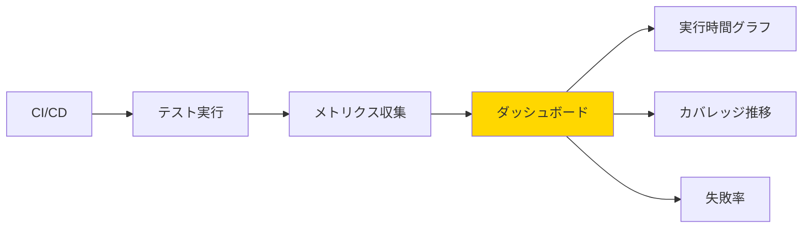

### トラブルシューティングガイド

#### よくある問題と解決方法

**問題1: テストが遅い**

```bash
# 並列実行の確認
npm run test -- --reporter=verbose

# キャッシュのクリア
rm -rf node_modules/.vitest
npm run test
```

**問題2: ウォッチモードが反応しない**

```bash
# 監視設定の確認
npm run test:watch -- --reporter=verbose

# ファイルシステムの制限を確認（macOS/Linux）
ulimit -n 10240
```

**問題3: カバレッジが生成されない**

```bash
# カバレッジプロバイダーの確認
npm list @vitest/coverage-v8

# 再インストール
npm install -D @vitest/coverage-v8
npm run test:coverage
```

### ドキュメント管理

#### 更新が必要なドキュメント

1. **README.md**:
   - テストコマンドの説明
   - 開発環境のセットアップ手順

2. **CONTRIBUTING.md**:
   - テストの書き方
   - プロパティベーステストのガイドライン

3. **tech.md**（ステアリングルール）:
   - テストフレームワークの情報更新
   - Vitest固有の設定

4. **移行レポート**:
   - 移行前後の比較
   - パフォーマンス測定結果
   - 既知の問題と回避策

### チーム教育

#### 学習リソース

- [Vitest公式ドキュメント](https://vitest.dev/)
- [JestからVitestへの移行ガイド](https://vitest.dev/guide/migration.html)
- [プロパティベーステスト入門](https://fast-check.dev/)

#### 移行後のレビューポイント

新規テストのコードレビュー時に確認：

- [ ] `vitest` からのインポートを使用している
- [ ] `vi.fn()`, `vi.mock()` を使用している
- [ ] プロパティベーステストに適切なタグが付いている
- [ ] テストが適切に並列実行可能である

### 継続的改善

#### 定期的なレビュー項目

**月次**:

- テスト実行時間の推移確認
- カバレッジの推移確認
- 失敗率の分析

**四半期**:

- Vitestのバージョンアップ検討
- テスト戦略の見直し
- パフォーマンス最適化の検討

**年次**:

- テストフレームワークの評価
- 新しいテスト手法の導入検討

## まとめ

### 移行の利点

1. **パフォーマンス向上**
   - テスト実行時間の短縮（30-50%改善見込み）
   - ウォッチモードの高速化（60%以上改善見込み）
   - キャッシュ機能による2回目以降の高速化

2. **開発体験の改善**
   - UIモードによる視覚的なテスト管理
   - 高速なウォッチモード
   - より良いエラーメッセージ

3. **設定の簡素化**
   - ts-jest不要（Vitestが直接TypeScriptをサポート）
   - Vite設定の再利用
   - シンプルな設定ファイル

4. **互換性の維持**
   - Jest互換API（学習コスト低）
   - 既存のテストライブラリをそのまま使用
   - fast-checkなどのツールも継続利用可能

### 技術的な決定事項

| 項目                   | 決定内容              | 理由                         |
| ---------------------- | --------------------- | ---------------------------- |
| Vitestバージョン       | 2.1.0以上             | 最新機能とパフォーマンス改善 |
| テスト環境             | jsdom                 | Reactコンポーネントテスト用  |
| グローバルAPI          | 有効（globals: true） | Jest互換性の維持             |
| カバレッジプロバイダー | v8                    | 高速で正確                   |
| モック処理             | inline設定            | next-intl対応                |
| 並列実行               | デフォルト有効        | パフォーマンス最適化         |

### 移行の成功基準

移行が成功したと判断する基準：

1. **機能的な成功**
   - [ ] すべてのテストがパスする（14ファイル）
   - [ ] カバレッジが移行前と同等以上
   - [ ] E2Eテストが影響を受けていない
   - [ ] TypeScript型エラーがない

2. **パフォーマンス的な成功**
   - [ ] テスト実行時間が移行前以下
   - [ ] ウォッチモードの反応速度が向上
   - [ ] メモリ使用量が許容範囲内

3. **運用的な成功**
   - [ ] CI/CDが正常に動作
   - [ ] ドキュメントが更新されている
   - [ ] チームメンバーが新しいワークフローを理解

### 推定工数

| フェーズ  | 作業内容           | 推定時間  |
| --------- | ------------------ | --------- |
| フェーズ1 | 準備               | 15分      |
| フェーズ2 | 依存関係更新       | 10分      |
| フェーズ3 | 設定ファイル作成   | 20分      |
| フェーズ4 | テストファイル変換 | 30分      |
| フェーズ5 | 動作確認           | 30分      |
| フェーズ6 | クリーンアップ     | 15分      |
| **合計**  |                    | **2時間** |

### 次のステップ

移行完了後に実施すべき項目：

1. **即時**
   - 移行レポートの作成
   - ドキュメントの更新
   - チームへの共有

2. **1週間以内**
   - パフォーマンスメトリクスの収集
   - 問題点の洗い出し
   - 改善点の特定

3. **1ヶ月以内**
   - テスト戦略の見直し
   - 新しいベストプラクティスの確立
   - チーム教育の実施

### 参考資料

#### 公式ドキュメント

- [Vitest公式サイト](https://vitest.dev/)
- [Vitest設定リファレンス](https://vitest.dev/config/)
- [JestからVitestへの移行ガイド](https://vitest.dev/guide/migration.html)
- [Vitest API リファレンス](https://vitest.dev/api/)

#### 関連ライブラリ

- [@testing-library/react](https://testing-library.com/docs/react-testing-library/intro/)
- [@testing-library/jest-dom](https://github.com/testing-library/jest-dom)
- [fast-check](https://fast-check.dev/)
- [jsdom](https://github.com/jsdom/jsdom)

#### 内部ドキュメント

- `docs/vitest-migration-plan.md`: 詳細な移行計画
- `.kiro/specs/jest-to-vitest-migration/requirements.md`: 要件定義
- `.kiro/steering/tech.md`: 技術スタック情報

---

**ドキュメントバージョン**: 1.0  
**作成日**: 2025年  
**最終更新**: 2025年  
**ステータス**: レビュー待ち
