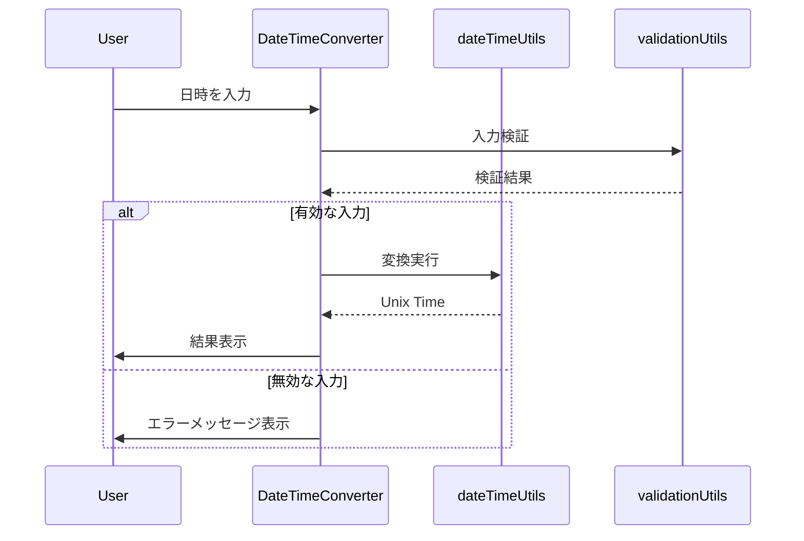
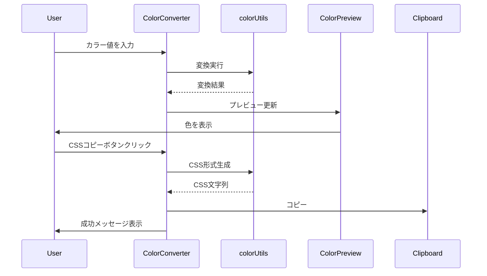
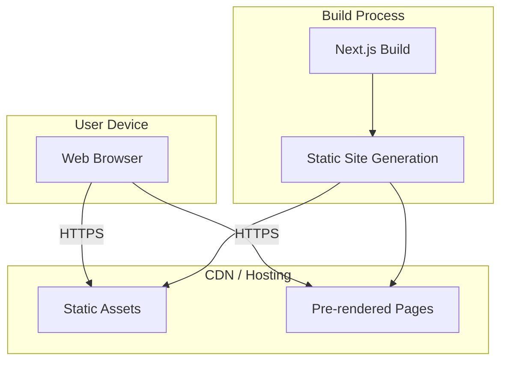
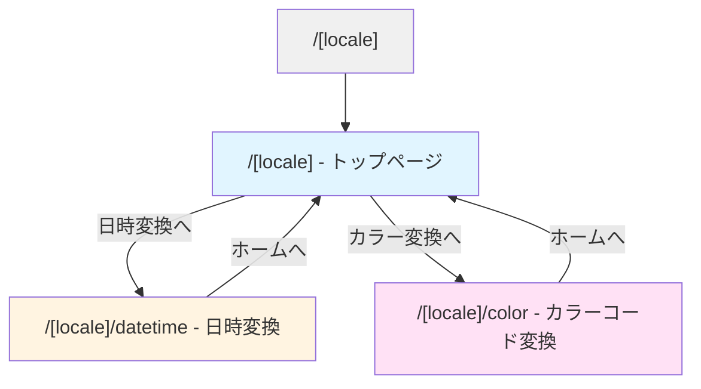
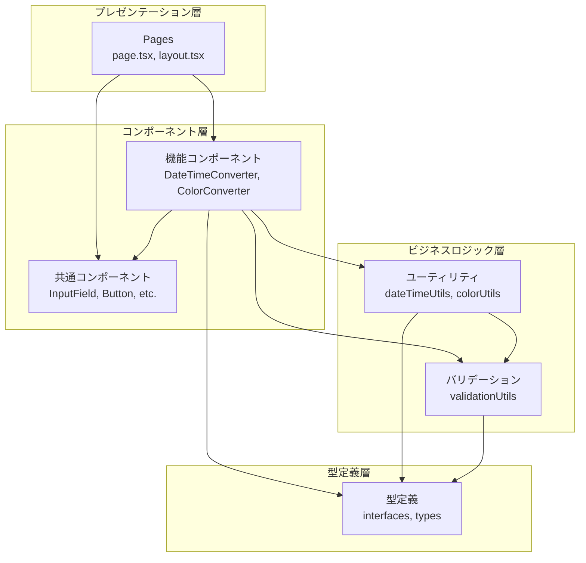

# Data Converter Site アーキテクチャドキュメント

## プロジェクト概要

Data Converter Siteは、開発者やデザイナーが日常的に必要とするデータ変換機能を提供するWebアプリケーションです。シンプルで直感的なUIを通じて、日時形式の変換とカラーコードの変換を高速に実行できます。

### 目的

- 日時とUnix Time(エポックタイム)の相互変換を簡単に実行
- 複数のカラーフォーマット間の変換を一箇所で完結
- ブックマーク可能な独立したURLで各機能にアクセス
- レスポンシブでアクセシブルなユーザー体験の提供

### 主要な特徴

- **クライアントサイド処理**: すべての変換処理はブラウザ内で完結し、高速なレスポンスを実現
- **機能の独立性**: 各変換機能は独立したページとして実装され、個別に開発・テスト可能
- **拡張性**: 新しい変換機能の追加が容易な設計
- **国際化対応**: 英語(標準)と日本語に対応、将来的な言語追加が容易
- **テスト駆動開発**: ユニットテストとプロパティベーステストによる高品質な実装

## 利用技術

### フロントエンド

| 技術         | バージョン | 用途                                     |
| ------------ | ---------- | ---------------------------------------- |
| Next.js      | 16.1.6     | Reactフレームワーク、App Router、SSR/SSG |
| React        | 19.2.3     | UIライブラリ                             |
| TypeScript   | 5.x        | 型安全な開発                             |
| Tailwind CSS | 4.x        | ユーティリティファーストのスタイリング   |
| next-intl    | 最新       | 国際化(i18n)対応                         |

### 開発ツール

| 技術       | バージョン | 用途                   |
| ---------- | ---------- | ---------------------- |
| ESLint     | 9.x        | コード品質チェック     |
| fast-check | 最新       | プロパティベーステスト |
| Playwright | 最新       | E2Eテスト              |
| PostCSS    | 最新       | CSS処理                |

### TypeScript設定

- **Strict mode**: 有効
- **パスエイリアス**: `@/*` → `./src/*`
- **Target**: ES2017
- **JSX**: react-jsx

## 実装機能概要

### 1. 日時変換機能 (/datetime)

**機能:**

- 人間が読める日時形式とUnix Timeの相互変換
- 複数の日時形式のサポート
  - 標準形式: `YYYY/mm/DD HH:MM:SS`
  - ISO 8601形式: `2024-01-01T12:00:00Z`
- タイムゾーン対応(UTC、Asia/Tokyo、America/New_Yorkなど)
- 秒・ミリ秒単位の切り替え

**主要コンポーネント:**

- `DateTimeConverter`: メインの変換UIコンポーネント
- `dateTimeUtils`: 日時変換ロジック
- `validationUtils`: 入力検証

**データフロー:**



### 2. カラーコード変換機能 (/color)

**機能:**

- 複数のカラーフォーマット間の相互変換
  - RGB (0-255)
  - ARGB (Alpha + RGB)
  - HEX (#RRGGBB, #AARRGGBB)
  - CMYK (0-100%)
  - HSL (H: 0-360, S/L: 0-100%)
- リアルタイムカラープレビュー
- CSS形式でのコピー機能(rgb(), rgba(), hex, hsl())

**主要コンポーネント:**

- `ColorConverter`: メインの変換UIコンポーネント
- `ColorPreview`: カラープレビュー表示
- `colorUtils`: カラー変換ロジック
- `validationUtils`: 入力検証

**データフロー:**



### 3. ナビゲーション機能

**機能:**

- トップページから各機能へのリンク
- 各ページ間の移動
- レスポンシブなナビゲーションUI

**主要コンポーネント:**

- `Navigation`: ナビゲーションメニュー
- `RootLayout`: 共通レイアウト

## インフラ構成

### デプロイメント構成



### ホスティング

本アプリケーションは完全にクライアントサイドで動作するため、以下のような静的ホスティングサービスにデプロイ可能です:

- **Vercel** (推奨): Next.jsとの統合が最適化されている
- **Netlify**: 静的サイトホスティング
- **GitHub Pages**: 無料の静的ホスティング
- **AWS S3 + CloudFront**: スケーラブルな静的ホスティング

### ビルドプロセス

```bash
# 開発環境
npm run dev          # 開発サーバー起動 (localhost:3000)

# プロダクション環境
npm run build        # 最適化されたビルド生成
npm run start        # プロダクションサーバー起動

# テスト
npm run test         # ユニット・プロパティテスト実行
npm run test:e2e     # E2Eテスト実行
npm run lint         # コード品質チェック
```

## サイトマップ



### ページ構成

| パス                 | 説明                   | 主要機能                                            |
| -------------------- | ---------------------- | --------------------------------------------------- |
| `/[locale]`          | トップページ           | 各機能へのナビゲーション、機能概要の表示            |
| `/[locale]/datetime` | 日時変換ページ         | 日時⇔Unix Timeの相互変換、タイムゾーン選択          |
| `/[locale]/color`    | カラーコード変換ページ | 各カラーフォーマット間の変換、プレビュー、CSSコピー |

### 国際化対応

- **サポート言語**: 英語(en)、日本語(ja)
- **デフォルト言語**: 英語
- **URL構造**: `/en/`, `/ja/` のようにロケールをパスに含める
- **言語切り替え**: ヘッダーに言語切り替えUIを配置
- **言語設定の保存**: ブラウザのlocalStorageに保存

## クラス図

```mermaid
classDiagram
    %% ページコンポーネント
    class RootLayout {
        +ReactNode children
        +Metadata metadata
        +render() ReactElement
    }

    class HomePage {
        +render() ReactElement
    }

    class DateTimePage {
        +render() ReactElement
    }

    class ColorPage {
        +render() ReactElement
    }

    %% 機能コンポーネント
    class DateTimeConverter {
        -DateTimeState state
        -setState() void
        +handleInputChange(value: string) void
        +handleTimezoneChange(tz: string) void
        +handleUnitChange(unit: string) void
        +handleFormatChange(format: string) void
        +convertToUnixTime() void
        +convertFromUnixTime() void
        +render() ReactElement
    }

    class ColorConverter {
        -ColorValues colorValues
        -ColorFormat activeFormat
        -string previewColor
        -string error
        +handleColorChange(format: ColorFormat, value: any) void
        +handleFormatChange(format: ColorFormat) void
        +convertColor() void
        +copyToClipboard(format: string) void
        +render() ReactElement
    }

    class Navigation {
        +NavigationLink[] links
        +render() ReactElement
    }

    %% 共通UIコンポーネント
    class InputField {
        +string label
        +string value
        +string error
        +Function onChange
        +string type
        +boolean required
        +render() ReactElement
    }

    class Button {
        +string label
        +Function onClick
        +string variant
        +boolean disabled
        +render() ReactElement
    }

    class ColorPreview {
        +string color
        +number size
        +render() ReactElement
    }

    class ErrorMessage {
        +string message
        +string type
        +render() ReactElement
    }

    %% ユーティリティクラス
    class DateTimeUtils {
        +parseDateTime(input: string, format: string) Date
        +toUnixTime(date: Date, unit: string) number
        +fromUnixTime(timestamp: number, unit: string) Date
        +formatDateTime(date: Date, format: string, tz: string) string
        +validateDateTime(input: string) boolean
    }

    class ColorUtils {
        +rgbToHex(r: number, g: number, b: number) string
        +hexToRgb(hex: string) RGB
        +rgbToCmyk(r: number, g: number, b: number) CMYK
        +cmykToRgb(c: number, m: number, y: number, k: number) RGB
        +rgbToHsl(r: number, g: number, b: number) HSL
        +hslToRgb(h: number, s: number, l: number) RGB
        +validateColorValue(value: number, format: ColorFormat) boolean
        +formatCss(color: ColorValues, format: ColorFormat) string
    }

    class ValidationUtils {
        +validateDateTime(input: string) ValidationResult
        +validateUnixTime(input: string) ValidationResult
        +validateRgb(r: number, g: number, b: number) ValidationResult
        +validateHex(hex: string) ValidationResult
        +validateCmyk(c: number, m: number, y: number, k: number) ValidationResult
        +validateHsl(h: number, s: number, l: number) ValidationResult
    }

    %% 型定義
    class DateTimeState {
        +string inputValue
        +string outputValue
        +string timezone
        +string unit
        +string format
        +string error
    }

    class ColorValues {
        +RGB rgb
        +ARGB argb
        +string hex
        +CMYK cmyk
        +HSL hsl
    }

    class RGB {
        +number r
        +number g
        +number b
    }

    class ARGB {
        +number a
        +number r
        +number g
        +number b
    }

    class CMYK {
        +number c
        +number m
        +number y
        +number k
    }

    class HSL {
        +number h
        +number s
        +number l
    }

    %% 関係性
    RootLayout --> HomePage
    RootLayout --> DateTimePage
    RootLayout --> ColorPage

    HomePage --> Navigation

    DateTimePage --> DateTimeConverter
    DateTimeConverter --> InputField
    DateTimeConverter --> Button
    DateTimeConverter --> ErrorMessage
    DateTimeConverter --> DateTimeUtils
    DateTimeConverter --> ValidationUtils
    DateTimeConverter ..> DateTimeState

    ColorPage --> ColorConverter
    ColorConverter --> InputField
    ColorConverter --> Button
    ColorConverter --> ColorPreview
    ColorConverter --> ErrorMessage
    ColorConverter --> ColorUtils
    ColorConverter --> ValidationUtils
    ColorConverter ..> ColorValues

    ColorValues --> RGB
    ColorValues --> ARGB
    ColorValues --> CMYK
    ColorValues --> HSL

    DateTimeUtils --> ValidationUtils
    ColorUtils --> ValidationUtils
```



## アーキテクチャの特徴

### レイヤー構造



### 設計原則

1. **単一責任の原則**: 各コンポーネントとユーティリティは単一の責任を持つ
2. **依存性の逆転**: 上位層は下位層に依存するが、下位層は上位層に依存しない
3. **開放閉鎖の原則**: 新機能の追加は容易だが、既存コードの変更は最小限
4. **インターフェース分離**: 必要なインターフェースのみを公開

### パフォーマンス最適化

- **React.memo**: 不要な再レンダリングを防止
- **useCallback**: 関数の再生成を防止
- **useMemo**: 計算結果のメモ化
- **Next.js App Router**: 自動コード分割とプリフェッチ
- **Tailwind CSS**: 未使用CSSの自動削除

### 国際化(i18n)

- **ライブラリ**: next-intl (Next.js App Router対応)
- **ロケール管理**: URLベースのロケール管理 (`/[locale]/...`)
- **翻訳ファイル**: JSON形式で `messages/` ディレクトリに配置
- **言語切り替え**: クライアントサイドでの動的切り替え
- **フォールバック**: 翻訳が見つからない場合は英語にフォールバック
- **拡張性**: 新しい言語の追加は翻訳ファイルを追加するだけ

### セキュリティ

- **XSS対策**: Reactの自動エスケープ機能
- **CSP**: Content Security Policyの設定
- **HTTPS**: 本番環境では必須
- **入力検証**: すべてのユーザー入力を検証

### アクセシビリティ

- **セマンティックHTML**: 適切なHTML要素の使用
- **ARIA属性**: スクリーンリーダー対応
- **キーボード操作**: すべての機能をキーボードで操作可能
- **カラーコントラスト**: WCAG 2.1 AA準拠
- **フォーカス管理**: 明確なフォーカスインジケーター

## 拡張性

### 新機能の追加手順

1. **ルート作成**: `src/app/[feature-name]/page.tsx`を作成
2. **コンポーネント実装**: 機能固有のコンポーネントを実装
3. **ユーティリティ実装**: `src/lib/[feature-name]Utils.ts`を作成
4. **テスト実装**: ユニットテストとプロパティテストを作成
5. **ナビゲーション更新**: トップページにリンクを追加
6. **ドキュメント作成**: `docs/features/[feature-name]/`にドキュメントを作成

### 想定される将来の機能

- Base64エンコード/デコード
- JSON整形・検証
- URL エンコード/デコード
- ハッシュ生成(MD5, SHA-256など)
- 単位変換(長さ、重さ、温度など)
